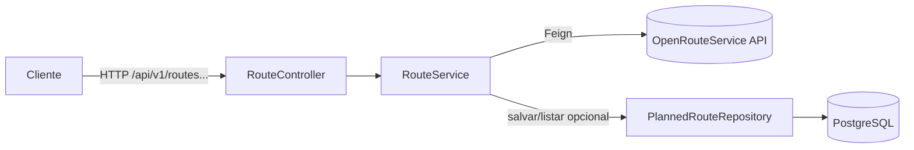

# TDD - Planejamento Pessoal de Rotas (personalRouter)

| Campo            | Valor                                            |
| ---------------- | ------------------------------------------------ |
| Tech Lead        | @Filipe (filipe.azvdo@gmail.com)                 |
| Time             | Filipe                                           |
| Epic/Ticket      | TBD                                              |
| Status           | Draft                                            |
| Criado em        | 2026-06-13                                       |
| Última atualização | 2026-06-13 (questões em aberto resolvidas)     |
| Tipo             | Integração externa + Nova funcionalidade         |
| Porte            | Pequeno (< 1 semana)                             |

---

## Contexto

O **personalRouter** é uma API REST backend em Java 21 + Spring Boot 3.x. Esta é a primeira
funcionalidade de negócio do projeto: uma API de **planejamento pessoal de rotas**.

A ideia é simples: dado um ponto de origem (A), um destino (B) e, opcionalmente, alguns pontos
de parada intermediários, a API calcula a rota (distância e tempo estimado) consumindo um
serviço externo de roteamento — o **OpenRouteService (ORS)** — e devolve o resultado. O usuário
pode, opcionalmente, salvar uma rota planejada para consultar depois.

**Domínio:** planejamento/roteamento pessoal (não comercial, sem dados sensíveis de terceiros).

**Stakeholders:** uso pessoal (instância única). Não há múltiplos usuários, equipe de produto
ou requisitos de compliance neste momento.

---

## Definição do Problema & Motivação

### Problemas que estamos resolvendo

- **Não há forma estruturada de planejar e guardar rotas pessoais com paradas.** Hoje o
  planejamento é feito manualmente em apps de mapa, sem possibilidade de salvar/reusar rotas
  com paradas definidas de forma programática.
- **Não existe um backend reutilizável de roteamento.** Qualquer cliente futuro (app, script,
  frontend) teria que falar direto com o provedor de mapas, duplicando lógica e expondo a
  chave de API.

### Por que agora?

- É a funcionalidade fundadora do projeto `personalRouter` — define a estrutura base (camadas,
  integração externa via Feign, persistência) que servirá de fundação para evoluções futuras.

### Impacto de NÃO resolver

- O projeto continua sem nenhuma funcionalidade de negócio.
- Sem uma camada de integração isolada, a chave da API externa e a lógica de roteamento ficariam
  espalhadas/repetidas em qualquer cliente.

---

## Escopo

### ✅ Dentro do escopo (V1 - MVP)

- Cálculo de rota A → B consumindo o **OpenRouteService** via Feign Client.
- Suporte a **pontos de parada (waypoints)** intermediários, na ordem informada — **até 10 paradas** por rota.
- **Perfil de transporte fixo no MVP: `driving-car` (carro).**
- Retorno de **distância total, duração estimada, geometria** (sempre presente) e resumo por trecho.
- **Persistência opcional** (híbrida): endpoint que apenas calcula (preview) e endpoint que
  calcula **e salva** a rota planejada.
- **CRUD básico** de rotas salvas: criar (salvando), listar, detalhar e excluir.

### ❌ Fora do escopo (V1)

- Autenticação/autorização de usuário (JWT) — uso pessoal, sem login no MVP.
- Múltiplos usuários / isolamento de dados por usuário.
- Outros perfis de transporte (bicicleta, a pé) — apenas `driving-car` no MVP.
- Otimização de ordem das paradas (problema do caixeiro-viajante / `optimize_waypoints`).
- Rotas alternativas, trânsito em tempo real, ETA dinâmico.
- Frontend / mapa visual.
- Cache distribuído (Redis) e múltiplos provedores de roteamento.

### 🔮 Considerações futuras (V2+)

- Autenticação JWT por usuário (alinhado ao padrão do `agents.md`).
- Perfis adicionais de transporte: `cycling-regular` (bicicleta) e `foot-walking` (a pé).
- Otimização da ordem das paradas.
- Suporte a múltiplos provedores de roteamento (estratégia pluggable).
- Cache de rotas idênticas para reduzir consumo da cota da API externa.

---

## Solução Técnica

### Visão geral da arquitetura

A API segue a arquitetura em camadas definida no `agents.md`
(`controller → service → client/repository`). A integração com o OpenRouteService é isolada
em um Feign Client dedicado, e a resposta externa é traduzida para um DTO de domínio antes de
subir para a camada de serviço.

**Componentes principais:**

- `RouteController`: expõe os endpoints REST, valida entrada e orquestra a resposta.
- `RouteService` (interface) / `RouteServiceImpl`: regra de negócio — monta as coordenadas,
  invoca o client externo, traduz erros e decide persistência.
- `OpenRouteServiceClient`: Feign Client que encapsula a chamada ao ORS (timeout, retry, chave).
- `PlannedRouteRepository`: persistência das rotas salvas (Spring Data JPA).
- `RouteMapper`: mapeamento entre entidade/DTOs e resposta do ORS (MapStruct).

**Diagrama de arquitetura:**



### Fluxo de dados

**Calcular rota (preview, sem salvar):**

1. Cliente → `POST /api/v1/routes/plan` com origem, destino, paradas e perfil.
2. `RouteController` valida o corpo (Bean Validation) e chama o `RouteService`.
3. `RouteService` monta o array de coordenadas no formato exigido pelo ORS
   (**atenção: ORS usa `[longitude, latitude]`**), na ordem origem → paradas → destino.
4. `OpenRouteServiceClient` chama o ORS enviando a chave de API no header.
5. ORS responde com resumo (distância, duração), geometria e trechos.
6. `RouteService`/`RouteMapper` traduzem a resposta para `RouteResultDto`.
7. `RouteController` retorna `200 OK`.

**Calcular e salvar:**

- `POST /api/v1/routes` executa os passos 1–6 e, em seguida, persiste a rota via
  `PlannedRouteRepository`, retornando `201 Created` com o `id` gerado.

### APIs & Endpoints

| Endpoint                  | Método | Descrição                                  | Request           | Response           |
| ------------------------- | ------ | ------------------------------------------ | ----------------- | ------------------ |
| `/api/v1/routes/plan`     | POST   | Calcula a rota sem salvar (preview)        | `RoutePlanRequest`| `RouteResultDto`   |
| `/api/v1/routes`          | POST   | Calcula **e salva** a rota planejada       | `RoutePlanRequest`| `PlannedRouteDto`  |
| `/api/v1/routes`          | GET    | Lista as rotas salvas                      | -                 | `PlannedRouteDto[]`|
| `/api/v1/routes/{id}`     | GET    | Detalha uma rota salva                     | -                 | `PlannedRouteDto`  |
| `/api/v1/routes/{id}`     | DELETE | Remove uma rota salva                      | -                 | `204 No Content`   |

**Exemplo de Request/Response:**

```json
// POST /api/v1/routes/plan
{
  "profile": "driving-car",
  "origin":      { "lat": -23.5505, "lon": -46.6333, "label": "São Paulo - Sé" },
  "destination": { "lat": -22.9068, "lon": -43.1729, "label": "Rio de Janeiro - Centro" },
  "stops": [
    { "lat": -23.1865, "lon": -45.8841, "label": "São José dos Campos" }
  ]
}
```

```json
// Response 200 OK
{
  "profile": "driving-car",
  "distanceMeters": 430120,
  "durationSeconds": 19800,
  "geometry": "u{~vFvyys@fS]...",          // polyline codificada (ORS)
  "segments": [
    { "fromLabel": "São Paulo - Sé",        "toLabel": "São José dos Campos",     "distanceMeters": 95000,  "durationSeconds": 4200  },
    { "fromLabel": "São José dos Campos",   "toLabel": "Rio de Janeiro - Centro", "distanceMeters": 335120, "durationSeconds": 15600 }
  ]
}
```

> Para `POST /api/v1/routes` o corpo é o mesmo, acrescido de um campo opcional `name`; a resposta
> (`201 Created`) é o `PlannedRouteDto`, que inclui `id` e `createdAt`.

**Validações de entrada (Bean Validation):**

- `origin` e `destination` obrigatórios; `lat` ∈ [-90, 90] e `lon` ∈ [-180, 180].
- `profile` opcional; no MVP o único valor aceito é `driving-car` (default quando omitido).
  Qualquer outro valor → `400`.
- `stops` opcional; **máximo de 10 paradas** — acima disso → `400` (controle de payload e consumo
  da cota externa).
- A **geometria é sempre calculada e retornada** (e persistida, quando a rota é salva), no formato
  **polyline codificada** do ORS.

### Mudanças no banco de dados

**Novas tabelas (PostgreSQL):**

- `planned_route` — rota planejada salva
  - Campos principais: `id` (UUID, PK), `name`, `profile`, `origin_lat`, `origin_lon`,
    `origin_label`, `destination_lat`, `destination_lon`, `destination_label`,
    `distance_meters`, `duration_seconds`, `geometry` (TEXT, polyline codificada)
  - Timestamps: `created_at`, `updated_at`
  - Índices: `created_at` (ordenação da listagem)

- `planned_route_stop` — paradas intermediárias (coleção ordenada filha de `planned_route`)
  - Campos: `id` (PK), `planned_route_id` (FK), `lat`, `lon`, `label`, `stop_order`
  - Índice: `planned_route_id`

**Estratégia de migração:**

- Migrations versionadas com Flyway (conforme `agents.md` §3).
- Testadas via Testcontainers antes do merge.

> **Decisão:** as paradas ficam em tabela filha ordenada (`stop_order`) em vez de uma coluna
> JSONB, por serem entidades de domínio consultáveis e por aderirem melhor ao padrão JPA do
> projeto. JSONB foi considerado, mas adiciona complexidade de mapeamento sem ganho relevante
> neste MVP.

### Integração com o OpenRouteService

- Chamada via `@FeignClient` isolado em `client/`, com **timeout e política de retry explícitos**
  (conforme `agents.md` §5) — sem usar defaults silenciosos.
- Endpoint do ORS: `POST /v2/directions/{profile}` com corpo contendo o array `coordinates`
  no formato `[[lon, lat], ...]`.
- Autenticação no ORS via **chave de API enviada no header**, lida de variável de ambiente
  (nunca hardcoded — `agents.md` §8).
- Erros do ORS (4xx/5xx, timeout, cota excedida) são **capturados e traduzidos para exceções de
  domínio** antes de subir para o `RouteService` (`agents.md` §5 e §7).
- Respostas de erro da nossa API seguem **ProblemDetail (RFC 7807)** via `@RestControllerAdvice`.

---

## Riscos

| Risco                                                   | Impacto | Probabilidade | Mitigação                                                                                          |
| ------------------------------------------------------- | ------- | ------------- | -------------------------------------------------------------------------------------------------- |
| Cota da API ORS excedida (free tier limita req/dia e min)| Médio   | Média         | Tratar `429`, limitar nº de paradas, planejar cache de rotas idênticas (V2), logar consumo          |
| Indisponibilidade/lentidão do ORS                       | Alto    | Baixa         | Timeout + retry explícitos no Feign; traduzir falha para `503` com ProblemDetail claro              |
| Inversão da ordem `lon/lat` ao montar coordenadas       | Médio   | Média         | Encapsular a conversão em **um único ponto**; validar ranges; cobrir com testes específicos         |
| Vazamento da chave de API (commit acidental)            | Alto    | Baixa         | Chave somente via variável de ambiente; `application-local.yml` no `.gitignore`; nunca logar a chave|
| Payload/geometria grande ao persistir rotas longas      | Baixo   | Média         | Armazenar **polyline codificada** (não a lista completa de pontos); limitar nº de paradas           |
| Mudança no contrato da API externa (ORS)                | Baixo   | Baixa         | Traduzir resposta para DTO de domínio; testes de contrato com payload mockado                       |

**Escala** — Impacto: Alto (indisponível/erro grave) / Médio (UX degradada) / Baixo (inconveniência menor).
Probabilidade: Alta (>50%) / Média (20–50%) / Baixa (<20%).

---

## Plano de Implementação

| Fase                       | Tarefa                         | Descrição                                                              | Status | Estimativa |
| -------------------------- | ------------------------------ | ---------------------------------------------------------------------- | ------ | ---------- |
| **Fase 1 - Setup**         | Config do projeto              | Dependências (Feign, MapStruct, Flyway), chave ORS via env var         | TODO   | 0.5d       |
| **Fase 2 - Integração**    | OpenRouteServiceClient         | Feign Client com timeout/retry, DTOs do ORS, conversão de coordenadas  | TODO   | 1d         |
| **Fase 3 - Core**          | RouteService + mappers         | Montagem de coordenadas, tradução de erros, exceções de domínio, MapStruct | TODO | 1.5d       |
| **Fase 4 - API**           | RouteController                | Endpoints (plan, create, list, get, delete), DTOs, anotações OpenAPI   | TODO   | 1d         |
| **Fase 5 - Persistência**  | Entidade + repositório + migration | `PlannedRoute`/`PlannedRouteStop`, repository, migration Flyway     | TODO   | 0.5d       |
| **Fase 6 - Testes**        | Unitários + integração         | Service/mapper (Mockito) + endpoints (Testcontainers + mock do ORS)    | TODO   | 1d         |

**Estimativa total:** ~5.5 dias (< 1 semana).

**Dependências entre fases:** Fase 2 deve preceder a 3; a 3, a 4. Persistência (5) pode correr
em paralelo à 4. Testes (6) acompanham cada fase e são consolidados ao final.

---

## Estratégia de Testes

| Tipo de Teste        | Escopo                                  | Abordagem                              |
| -------------------- | --------------------------------------- | -------------------------------------- |
| **Unitários**        | `RouteService`, `RouteMapper`           | JUnit 5 + Mockito                      |
| **Integração**       | Endpoints + PostgreSQL                  | Testcontainers (PostgreSQL real)       |
| **Integração externa** | Chamada ao ORS                        | Mock HTTP (ex.: WireMock) / stub Feign |

**Cenários principais:**

- ✅ Rota válida A → B (sem paradas) → `200` com distância/duração.
- ✅ Rota com paradas intermediárias na ordem correta.
- ✅ Coordenadas inválidas (lat/lon fora do range) → `400` (ProblemDetail).
- ✅ Perfil inválido/não suportado → `400`.
- ✅ ORS retorna `429` (cota) → traduzido para `503`/erro claro de domínio.
- ✅ ORS timeout/indisponível → tratamento gracioso com ProblemDetail.
- ✅ Salvar rota (`POST /routes`) → `201` e rota recuperável via `GET`.
- ✅ Listar e detalhar rotas salvas.
- ✅ Excluir rota salva → `204`; `GET` posterior → `404`.

**Cobertura mínima:** **80%** medida via JaCoCo e validada no build (conforme `agents.md` §10).

---

## Considerações de Segurança

> Projeto pessoal, sem dados de terceiros e sem login no MVP. A principal preocupação de
> segurança é a **gestão da chave da API externa**.

- **Chave do OpenRouteService:** apenas via variável de ambiente (`application.yml` +
  `${ORS_API_KEY}`), **nunca** hardcoded ou commitada; nunca registrada em logs (`agents.md` §8/§9).
- **Sem autenticação de usuário (MVP):** como o `agents.md` define endpoints protegidos por
  padrão, as rotas desta API devem ser **declaradas explicitamente como públicas** na configuração
  do Spring Security (ou a segurança fica desabilitada para o MVP). Recomenda-se rodar a instância
  **restrita à rede local** já que não há login. Autenticação JWT fica marcada como evolução (V2).
- **Validação de entrada:** Bean Validation em todos os endpoints para evitar payloads abusivos
  (ranges de coordenadas, limite de paradas).
- **Respostas de erro:** nunca expor stack traces ou detalhes internos; usar ProblemDetail
  (RFC 7807), conforme `agents.md` §7.

---

## Dependências

| Dependência            | Tipo           | Status        | Risco                                       |
| ---------------------- | -------------- | ------------- | ------------------------------------------- |
| OpenRouteService API   | Externo        | Disponível    | Médio (cota do free tier — limites req/dia) |
| Chave de API do ORS    | Externo        | A obter (grátis) | Baixo                                    |
| PostgreSQL             | Infraestrutura | A configurar  | Baixo                                       |
| Feign / MapStruct / Flyway | Biblioteca | No stack      | Baixo                                       |

**Bloqueios:** obter a chave gratuita do OpenRouteService antes da Fase 2.

---

## Decisões Resolvidas

| # | Questão                                                       | Decisão                                                   | Data       |
| - | ------------------------------------------------------------- | --------------------------------------------------------- | ---------- |
| 1 | Limite máximo de paradas por rota                             | ✅ **Até 10 paradas** (acima disso → `400`)                | 2026-06-13 |
| 2 | Perfis de transporte no MVP                                   | ✅ **Somente `driving-car`** (bici e a pé → V2)            | 2026-06-13 |
| 3 | A geometria deve ser retornada/persistida sempre ou sob demanda | ✅ **Sempre** retornada e persistida                     | 2026-06-13 |
| 4 | Formato da geometria                                          | ✅ **Polyline codificada** (menor footprint; GeoJSON → V2) | 2026-06-13 |

**Legenda:** ✅ Resolvido
